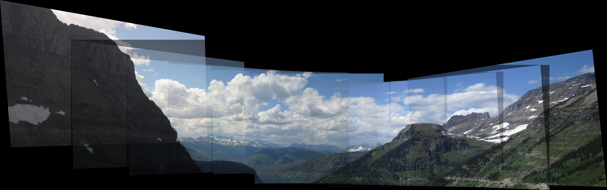

# Panoramic Stitcher

A from-scratch panoramic image stitcher built in Python. Given a set of overlapping photos, it detects features, estimates homographies, and blends the images into a single wide-angle panorama.

## How It Works

1. **Feature Detection** — SIFT keypoints and descriptors are extracted from each image.
2. **Feature Matching** — Brute-force matching with Lowe's ratio test filters for reliable correspondences.
3. **Homography Estimation** — A custom DLT (Direct Linear Transform) solver computes the 3x3 projective transform. RANSAC rejects outliers over 2,000 iterations.
4. **Warping & Blending** — Images are warped onto a shared canvas via inverse mapping. Overlapping regions are averaged to reduce seam artifacts.
5. **Outward Stitching** — Stitching starts from the center image and works outward in both directions, keeping the middle of the panorama undistorted.

## Key Details

- Homography computed manually via SVD — no `cv2.findHomography`
- Custom perspective warp using inverse mapping and `cv2.remap`
- Handles up to 11 images (5 left, center, 5 right)
- Natural filename sorting so numbered photos stitch in order

## Usage

```bash
python panoramic_stitcher.py <directory_of_images>
```

Output is saved as `final_panorama.jpg`.

## Example

**Source images** (`glacier4/`): 12 overlapping photos of a glacier landscape.

**Result**:



## Requirements

- Python 3
- OpenCV (`cv2`)
- NumPy
